# QA-Core

**Autonomous Playwright test generation, powered by Claude.**

QA-Core is an AI agent that opens a real browser, explores your app, reviews its own work, and writes a Playwright test suite. Every test runs and passes once inside the agent before it is saved to disk, so you get specs that already work on day one.

Built on [Claude](https://www.anthropic.com/) by Anthropic. Distributed through [OpenClaw](https://openclaw.dev). Drives [Playwright](https://playwright.dev/).

## Table of contents

1. [What it does](#what-it-does)
2. [Why this is different](#why-this-is-different)
3. [How it works](#how-it-works)
4. [Quick start](#quick-start)
5. [Commands](#commands)
6. [Web UI](#web-ui)
7. [MCP server](#mcp-server-for-claude-desktop-cursor-cline-continue)
8. [Model routing and budgets](#model-routing-and-budgets)
9. [Evaluation results](#evaluation-results)
10. [Project layout](#project-layout)
11. [Configuration files](#configuration-files)
12. [Requirements](#requirements)
13. [About the author](#about-the-author)
14. [License](#license)

## What it does

QA-Core exposes three commands. Each one solves a different problem in test automation.

| Command | What you give it | What you get back |
| ------- | ---------------- | ----------------- |
| `npm run explore` | A live URL | A full Playwright suite written from a verified browser session, with a Page Object Model framework |
| `npm run generate` | A user story or Jira ticket | A Playwright spec built from acceptance criteria. You can run it to verify |
| `npm run heal` | A spec that broke because the page changed | The same spec with its broken selectors re-resolved on the live page, written back in place |

Generated files land under `output/<project-slug>/<run-id>/`, one directory per run (see [Output layout](#output-layout)).

## Why this is different

Most "AI test generators" take a single DOM snapshot, hand it to an LLM, and hope the output works. QA-Core does not do that.

It runs a real five-stage agent pipeline. Three stages use the LLM. Two don't.

* The **Planner** uses Haiku to read one page snapshot and write a numbered scenario list.
* The **Explorer** uses Opus and a tool-use loop to drive the browser. It navigates, clicks, fills, and asserts against the live page. Every action is verified before the next one. Cookies and storage are cleared between scenarios so tests do not inherit state from each other.
* The **Critic** uses Sonnet to review the trace and label each scenario as ship, weak, or fix.
* The **Reality-Check Replay** re-executes every recorded scenario in a fresh browser context. Scenarios that fail the second independent run are dropped before any spec is written. Zero LLM cost.
* The **Stability Iteration** runs each replay-survivor three more times. Scenarios that pass-then-fail are dropped as flaky. Produces a `flake_rate` metric per run. Zero LLM cost.
* The **Transcriber** is deterministic. It turns the verified trace into Playwright code with a matching `beforeEach` so the emitted spec runs under the same isolation policy.
* The **Healer** is on-demand and lives in the published [qa-core-heal](https://www.npmjs.com/package/qa-core-heal) package. When a real Playwright run fails because the page changed, it re-resolves the broken selectors live.

This means every line in the final spec corresponds to an action that already passed five independent executions in fresh browser contexts before the file is written: one exploration, one replay, three stability re-runs.

## How it works

```text
                         ┌── per-host memory ──┐
                         │  (loaded as cached  │
                         │   system block)     │
                         └──────────┬──────────┘
                                    │
[1] Planner   (Haiku)  ─────────────┘
    1 page snapshot then numbered scenario list

[2] Explorer  (Opus)  ◀─ tool-use loop with prompt caching
    navigate / click / fill / assert / get_dom / finish
    cookies + storage cleared between scenarios
    every action verified against the live page

[3] Critic    (Sonnet)
    reads the trace, returns ship / weak / fix verdicts

[4] Reality-Check Replay      (zero LLM cost)
    re-executes each scenario in a fresh browser context
    drops anything that fails the independent re-run

[5] Stability Iteration       (zero LLM cost)
    runs each replay-survivor 3 more times
    drops anything that pass-then-fails; reports flake_rate

       ↓

  trace transcriber then output/<run-id>/<name>.spec.ts
                       then run-report.json (plan, verdicts, cost, cascade,
                                             replay, stability)
```



```mermaid
flowchart LR
    classDef stage fill:#1a1a22,stroke:#b9a6ff,color:#f5f5f7
    classDef verify fill:#1a1f1a,stroke:#5dd5a4,color:#5dd5a4
    classDef optional fill:#131318,stroke:#f4c560,stroke-dasharray:5 5,color:#f4c560
    classDef io fill:#0d0d10,stroke:#5b5b66,color:#9d9da7
    classDef memory fill:#0d0d10,stroke:#5dd5a4,color:#5dd5a4

    URL["URL or Story"]:::io
    P["Planner (Haiku 4.5)"]:::stage
    REV["Review checkpoint"]:::optional
    E["Explorer (Opus 4.7) tool-use loop"]:::stage
    C["Critic (Sonnet 4.6) ship, weak, fix"]:::stage
    R["Reality-Check Replay (zero LLM)"]:::verify
    S["Stability Iteration 3x (zero LLM)"]:::verify
    T["Transcriber + axe-core"]:::stage
    H["Healer (deterministic) on-demand"]:::stage
    SPEC["Spec file (.ts or .js)"]:::io
    CI["CI and GitHub Actions"]:::io
    MEM["Per-host memory"]:::memory

    URL --> P
    P -.->|optional| REV
    REV -.->|from plan| E
    P --> E
    E --> C
    C --> R
    R --> S
    S --> T
    T --> SPEC
    SPEC --> CI
    SPEC -.->|on failure| H
    H -.->|patched| SPEC

    MEM -.->|cached prompt| P
    MEM -.->|cached prompt| E
    E -.->|observed intents| MEM
```

### The selector cascade

QA-Core picks selectors in this order: `getByRole`, then `getByLabel`, then `getByTestId`, then CSS as a last resort. A level only "wins" when it resolves to exactly one element. When a role / label match resolves to multiple elements, the cascade records an `ambiguous` flag and the transcriber emits `.first()` honestly — no silent strict-mode violations in CI. The level that resolved each call is logged and the Critic can flag overuse of CSS.

### Auto-injected accessibility checks

Every generated spec ships with an `@axe-core/playwright` accessibility check against the landing page. The check fails only on `critical` and `serious` WCAG 2 AA violations and logs the rest. This was a deliberate change in v2 — a zero-tolerance gate is unshippable because real marketing pages routinely have low-severity color-contrast nits that swamp the signal.

### Per-host memory

After each run, the agent saves what it learned about that site to `.qa-core/sites/<host>.json`. This includes the intents it observed and the selector cascade level that worked. The next run against the same host loads this memory into the system prompt as a cached block. Repeat runs are typically 90 percent cheaper than the cold path.

### Selector recovery and healing

Selector repair happens in two places, both deterministic.

During exploration, a selector that fails to resolve is recovered in-run (selector recovery). The agent drops the specific hint that failed and re-finds the element by its semantic intent, then continues. Each recovery is logged (`healed: <old> re-resolved to <new>`) and recorded in the run report. This is scoped to locators only. An assertion that fails is never recovered, because that may be a real bug. After two failed recoveries on the same selector it is recorded as a finding, not a silent pass.

Healing an existing spec is handled by the published [qa-core-heal](https://www.npmjs.com/package/qa-core-heal) package. `npm run heal -- <spec-path>` is a thin wrapper that forwards to it: the package opens the live page the spec targets, probes every locator, re-resolves only the broken ones, confirms each re-resolved locator still points at the same intended element (a heal to the wrong element is refused), and writes the repaired files back in place. It reads the page object too when the spec uses POM. Every selector it could not heal is reported. No model call, no spec run.

### More reference material

* Full reference: [`docs/DOCUMENTATION.md`](./docs/DOCUMENTATION.md). Every component, flag, env var, and file format.
* Flow diagram in SVG: [`docs/architecture.svg`](./docs/architecture.svg).
* Interactive HTML page: [`docs/architecture.html`](./docs/architecture.html).
* MCP install guide: [`docs/MCP.md`](./docs/MCP.md).

## Quick start

```bash
git clone https://github.com/sardar-usman/qa-core-agent.git
cd qa-core-agent
cp .env.example .env          # then add your ANTHROPIC_API_KEY
bash setup.sh                 # installs dependencies and Playwright Chromium
```

Required environment variable: `ANTHROPIC_API_KEY`. Get one at [console.anthropic.com](https://console.anthropic.com/settings/keys).

Optional: `QA_CORE_AUTH_URL`, `QA_CORE_AUTH_USER`, `QA_CORE_AUTH_PASS` if you want a stored auth session reused across tests. See [`tests/auth.setup.ts`](./tests/auth.setup.ts).

## Commands

### Explore a URL

```bash
npm run explore -- https://www.saucedemo.com/
npm run explore -- https://www.saucedemo.com/ --lang js      # JavaScript output
npm run explore -- https://www.saucedemo.com/ --name login   # custom filename
```

By default `/explore` emits a full Page Object Model framework. Output lands under `output/<timestamp>-<host>/`:

```text
output/20260514-160000-saucedemo-com/
  pages/
    BasePage.ts                    # base class with goto + expectVisible helpers
    SaucedemoPage.ts               # typed Locator fields + loginAs(user, pass)
  tests/
    saucedemo.spec.ts              # spec that uses the page object
  a11y/
    landing.a11y.spec.ts           # auto-injected WCAG 2 AA check
  run-report.json                  # cost, cascade stats, scenario list
```

The page class looks like this:

```typescript
export class SaucedemoPage extends BasePage {
  readonly url = "https://www.saucedemo.com/";
  readonly username: Locator;
  readonly password: Locator;
  readonly loginButton: Locator;
  readonly loginError: Locator;

  constructor(page: Page) {
    super(page);
    this.username    = page.getByRole("textbox", { name: "Username" });
    this.password    = page.getByRole("textbox", { name: "Password" });
    this.loginButton = page.getByRole("button",  { name: "Login" });
    this.loginError  = page.locator("[data-test=error]");
  }

  async loginAs(username: string, password: string): Promise<void> {
    await this.username.fill(username);
    await this.password.fill(password);
    await this.loginButton.click();
  }
}
```

And the spec that uses it:

```typescript
test("[happy] logged in with valid credentials", async ({ page }) => {
  await saucedemoPage.loginAs("standard_user", "secret_sauce");
  await expect(page).toHaveURL(/inventory/);
});
```

If you prefer a single-file output without the page object, pass `--no-pom`.

Other useful flags: `--features login,cart` limits planning to those features, and `--srs requirements.md` feeds a requirements document into the run (see the SRS-first workflow below).

### Multi-page discovery (cover the site, not just the entry page)

```bash
npm run explore -- https://your-app.example.com --discover
npm run explore -- https://your-app.example.com --urls /login,/cart,/checkout
```

With `--discover`, `--urls`, or `--srs`, the agent decides which pages to cover by walking a ladder and stopping at the first source that yields pages: URLs stated in the SRS (tagged with their feature), then your explicit `--urls` list, then the site's sitemap (robots.txt is read first and its Sitemap directive used), then a polite crawl, and finally the entry page alone with a warning naming why the other sources failed.

The remote sources are polite by design: robots.txt Disallow rules are always honored (a disallow-all robots skips the sitemap and both crawls entirely), the sitemap set is capped at 30 pages preferring shallow paths, and the crawl fetches one page at a time with a 500ms pause, identifies itself as `qa-core-agent-discovery`, stays same-origin, and stops at depth 2 or 15 pages. When the plain-fetch crawl finds nothing (client-rendered SPAs serve a shell with no links), a browser-assisted crawl reads the anchors off the rendered DOM under the same rules; static sites keep the cheap path. A large sitemap set is narrowed by a cheap Haiku call to the most relevant page per feature (max 8), with a deterministic shallowest-first fallback.

Runs are protected by a cost ceiling (`QA_CORE_COST_CEILING`, default $2). Hitting it no longer loses your work: the agent stops exploring, keeps every completed scenario, finishes the pipeline on them, and reports how many planned scenarios were never explored. Multi-page runs cover more ground, so give them a higher ceiling.

Detail pages behind generated ids (`product/<long-random-id>`) are handled carefully: the page filter prefers stable-path pages and keeps at most one such volatile page, and its scenarios reach the page the way a user does (open the listing, click the item by its visible name) instead of hardcoding a URL that breaks the next time the site reseeds its data.

### Data-driven tests (datasets)

When two or more recorded scenarios exercise the same form with different values (a valid submission, a rejected one, a boundary probe), the generated framework ships them as ONE parameterized test over `data/<feature>.json`:

```ts
import rawCases from '../../data/contact.json';
for (const c of dataCases) {
  test(`[data] contact — ${c.name}`, async ({ page }) => { /* fills from c.values */ });
}
```

Each case is `{ name, values, expect: 'success' | 'error', errorText?, ruleIds? }`. To grow the suite, add a case to the JSON by hand — no spec editing needed. With an SRS (`--srs`), stated validation rules add boundary and invalid cases automatically, tagged with their rule ids. Passwords and login-flow values never land in datasets, and generated-unique fields keep a `{{uniqueEmail}}` marker so every run gets a fresh value.

### Session reuse (storageState auth)

When a run records a successful login, the generated framework signs in ONCE and reuses the session everywhere:

* `tests/auth.setup.ts` replays the recorded login with credentials from `QA_CORE_TEST_USER` / `QA_CORE_TEST_PASS` (see the framework's `.env.example`; values are pre-filled only for public demo sites) and saves `playwright/.auth/user.json`.
* The Playwright config wires a `setup` project; authenticated tests depend on it and start logged in — their recorded login steps are stripped.
* Login tests keep their own project WITHOUT the saved session (a logged-in login test proves nothing) and read their credentials from the same env vars.

`npx playwright test` runs the setup automatically. Credentials never appear as literals in any generated file.

### Crash-safe checkpoint/resume

Every run writes `checkpoint.json` into its output directory after each completed scenario and at every phase boundary (discovery done, plan done, explorer done). The write is atomic, so a crash can never corrupt it. On a fully successful run the file is deleted; on ANY abnormal end it stays:

* the cost ceiling was hit
* your API credits ran out mid-run (the run stops cleanly, nothing crashes)
* the API kept failing after retries
* you pressed Ctrl+C

Each of those prints the same line: `Run stopped: <reason>. State saved. Resume with: npm run explore -- --resume <path>`. Resuming restores the plan, every completed scenario, and the spend so far, then continues where the run left off — completed scenarios are never explored (or billed) twice. The ceiling top-up flow is exactly this: hit the ceiling, raise `QA_CORE_COST_CEILING`, resume the checkpoint, and the new ceiling applies with the old spend counted against it.

```bash
npm run explore -- --resume output/shop-automation-framework/checkpoint.json
```

Each discovered page is then planned separately (up to 4 scenarios per page, 20 per run, planner cost itemized per page), and every scenario stays self-contained: it navigates to its own page first. Without all three flags, nothing changes: the run covers the entry page exactly as before.

### Review mode (sign-off before automation)

For team workflows where a lead needs to approve scenarios before the Explorer runs:

```bash
npm run explore -- https://www.saucedemo.com/ --review
# writes output/<run-id>/plan.csv and exits
```

Open `plan.csv` in Excel, Numbers, or Google Sheets. Set `Approve=no` on any row you want to skip. Then resume:

```bash
npm run explore -- --from-plan output/<run-id>/plan.csv
# skips Planner, runs Explorer + Critic + Transcriber on approved scenarios only
```

The Planner cost is paid only once. The CSV header preserves the target URL, so the resume command needs no extra arguments.

### Generate tests from a user story

```bash
npm run generate -- "As a user I want to log in so I can access my dashboard"
npm run generate -- "..." --lang js --base-url https://staging.example.com
```

This one does not open a browser. It produces code from acceptance criteria. Run the spec to verify it works against your real app. Pass `--srs requirements.md` to inject the documented rules as context, so the generated tests verify the stated constraints and not just the story text.

### SRS-first workflow (test what the document says)

Give the agent your requirements document and it understands the functionality before planning a single test:

```bash
npm run explore -- https://your-app.example.com --srs docs/requirements.md
```

1. The SRS is loaded (`.md`, `.txt`, `.pdf`, or `.docx`; capped at 60,000 characters) and one cheap Haiku call converts it into a requirements map: features, per-feature rules with stable ids (R1, R2, ...), and the roles the document names. Only what the SRS states is extracted; URLs and rules are never invented.
2. The map is written to `requirements-map.json` in the run directory and injected into the Planner, which now plans rule-first: scenarios are derived from the stated rules, and each scenario cites the rule ids it verifies in a third bracket, like `[login][negative][R3,R7] rejected a 5-character password`. A scenario discovered from the page with no matching rule is tagged `[-]`. With a map present the Planner may plan up to 4 scenarios per feature.
3. The run ends with a rule-coverage report: `rule-coverage.json` plus a console summary (`Rule coverage: X of Y rules covered`). Every uncovered rule is listed with why (`not-planned`, or `planned-but-dropped` when the citing scenario did not survive replay and stability). That list is the "considered, not automated" report.
4. Planning is systematic, not improvised: per feature the Planner walks a derivation checklist (equivalence partitions, boundary values, required-field omissions, format violations, state transitions the rules name), cites every rule a scenario verifies, and the coverage report records which checklist categories produced scenarios and which were skipped with a reason (`no-matching-control`, `budget`, `not-applicable`), one summary line per feature.

The map shape:

```typescript
{
  features: Array<{
    name: string;          // kebab-case slug, e.g. "login"
    description: string;   // one sentence
    urls?: string[];       // only when the SRS states them
    rules: Array<{
      id: string;          // R1, R2... unique across the map
      text: string;        // the rule in plain words
      type: 'validation' | 'behavior' | 'permission' | 'navigation';
    }>;
  }>;
  roles: string[];         // roles the SRS names, empty if none
  truncated: boolean;      // true when the document was cut at the cap
}
```

`--features` still wins for feature selection when both flags are set; the SRS rules keep steering the Planner either way. Without `--srs`, nothing changes: the Planner's input and output are exactly as before.

### Heal a spec that broke

```bash
npm run heal -- output/<run-id>/<name>.spec.ts [--base-url https://...] [--dry-run]
```

The command is a thin wrapper around the published [qa-core-heal](https://www.npmjs.com/package/qa-core-heal) package. It opens the live page the spec targets (from a `page.goto`, a page object's `url`, or `--base-url`) and probes every locator. A locator that still resolves is left untouched. A broken one is re-resolved on the live page, then confirmed to point at the same intended element before it is accepted. When the spec uses POM, the locators inside the imported page object are healed too. The repaired files are written back in place, `--dry-run` previews without writing, and the report names every heal and every selector it could not heal. This is deterministic: no model call and no spec run.

### Run the suite

```bash
npx playwright test output/<run-id>/<name>.spec.ts
```

Playwright is configured with Chromium, Firefox, WebKit, and mobile projects. CI mode adds retries, trace on first retry, and an HTML report.

## Output layout

Every run writes its own directory, so a run never overwrites another and the dashboard index can be rebuilt from the files alone:

```text
output/<project-slug>/<run-id>/       project slug = the URL host with www dropped and dots as hyphens (saucedemo-com), run id = UTC time + 6-char hash
  run-report.json                     always
  <brand>-automation-framework.zip    the framework (POM runs)
  checkpoint.json                     only when the run stopped early (resume with --resume)
  requirements-map.json, rule-coverage.json   SRS runs
  run-meta.json                       which surface started the run and its flags
output/<project-slug>/latest -> <run-id>     the newest completed run (a symlink, or latest.json)
```

`--out <dir>` still overrides the whole run directory. Runs from before this layout (`output/<brand>-automation-framework/` with a sibling zip) are moved once with:

```bash
npm run migrate-output -- --dry-run   # show the plan
npm run migrate-output                # move each legacy folder into the layout, dated from its report
```

The migration is idempotent; the index reads legacy folders in place until you run it.

## Dashboard

`npm run gateway` starts one process that serves the dashboard at `http://127.0.0.1:18789/`, the REST API under `/api/`, and the WebSocket at `/ws`. The dashboard is a Vite + React app in `dashboard/`; the gateway builds it on first start when `dashboard/dist` is missing.

```bash
npm run dashboard:dev      # Vite dev server on :5173, proxied to the gateway
npm run dashboard:build    # writes dashboard/dist, served by the gateway at /
```

Pages in this release: **Projects** (one card per host with last run, tests shipped, unresolved findings (status open or triaged), spend this month, coverage sparkline; a project known only from pre-v2 records shows n/a for tests shipped and unresolved findings, never 0, with a sub-line naming its pre-v2 runs and the scenarios they explored; the Unassigned card, pre-v2 records with no URL, sorts last and is muted; a card opens the project page), the **project page** at `/projects/<project-id>` (name, base URL as a link, environment badge only when set, the project's runs, its findings, requirements coverage across its SRS runs, and trends), **Findings** at `/findings` (one row per deduped finding across projects: project, scenario, expected, URL at the time, first and last seen run, times seen, status and notes editable inline; status is open / triaged / fixed / wont-fix through `PATCH /api/findings/<id>`, kept across every re-index; a finding never appears in a scenario table, a pass/fail count or a flake number), **Coverage** at `/coverage` (per project with SRS runs: every rule id seen across runs, its latest classification, the run that last covered it, and the considered-not-automated list with reasons, read from the rule-coverage rows the index recorded; a project without SRS runs says so and points at the Terminal page), **Trends** on the project page (three small charts over completed runs in run order: tests shipped, total cost, flake rate; points only, values labeled, from index rows; legacy, stopped, empty and failed runs are not charted and the caption says how many; a single completed run shows the point and says a trend needs two), **Runs** (filter by project and status; status, shipped/planned, cost, flake rate, duration, source, date), and **Run Detail** at `/runs/<run-id>`: the header, then the six-stage view rendered from `run-report.json` alone, then a scenarios table with the Critic verdict, repair status, replay and stability outcomes and shipped yes/no exactly as stored, artifact links for the files present in the run folder, and the stored events timeline (`events.jsonl`, written next to the report by every surface). Screenshots: [dark](./docs/ui/run-detail-dark.png), [light](./docs/ui/run-detail-light.png).

The six-stage view is a rail (Discovery, Plan, Explore, Review, Verify, Summary, each with a status and a one-line stat; click one to jump to its panel) over one panel per stage:

1. **Discovery**: the rung that produced the page set, every page with its source and feature tag, robots and rung warnings. A single-page run says "single-page run, no discovery".
2. **Plan**: the planner cost, the pages planned with their scenario counts, then every scenario with its feature, category and rule-id tags.
3. **Explore**: step count, scenarios recorded, explorer cost, gate injections, skips with reasons, incomplete scenarios, and selector recoveries (`report.heals`, what was asked for and what it re-resolved to).
4. **Review**: pass / rework / reject counts and the critic cost, the repair-pass banner (scenarios re-explored, spend), a card per verdict with its reasons, verdict journeys (`rework -> pass` kept, `rework -> reject` dropped), Critic verdicts that matched no scenario, and the Critic summary.
5. **Verify**: replay pass or fail per scenario, the stored stability pattern per scenario (`P-P-P`, `PFP`), stable / flaked / recovered counts, stabilizer cost.
6. **Summary**: three numbers first (tests shipped, total cost, findings plus uncovered rules), the reconciliation funnel from `report.reconciliation` (zero rows collapse into one line), the cost split (planner / explorer / critic / repair / stabilizer, summing to the total), rule coverage with the considered-not-automated list when an SRS ran, findings in violet under "Product behavior to review" (a Critic verdict that matched a finding is shown on its card), and the one download button for the framework zip.

Every value in the stage view is a field of the report copied by the server; the page computes nothing. Values the report does not carry (the step budget, the explorer sub-ceiling, the repair budget, per-page planner cost) are labelled as not recorded rather than invented.

### Terminal

`/terminal` starts a run from the dashboard. No shell: it sends QA-Core commands only (`/explore`, `/resume`, `/transcribe`, `/heal`, `/generate`, with every flag the CLI accepts). The composer has three tiers. The top row holds the URL, the features, the SRS attach and the Start button, with "ceiling $X.XX, stops cleanly if reached" beside Start read from the effective setting (a typed ceiling, else this tab's session override, else the gateway default). **Scope**, collapsed by default, holds pages (`--urls`), discovery, POM or inline output, language and the stabilizer. **Budget and models**, collapsed by default, holds the cost ceiling, repair reserve, max steps and the three model overrides; each shows the effective value with a "default" chip until you type one, or a "session override" chip when Settings set one. Placeholders are examples prefixed "e.g." and rendered dimmer than typed text; defaults are shown as values, never as placeholders. The command box is a read-only one-line preview of exactly what will run, with a copy button and an "edit command" toggle that opens the textarea; typing a command there fills the form, editing the form rewrites the preview. When the project SRS is checked the preview shows `--srs <project srs path>`; when a file is attached it shows the run-folder path. Both go through one parser, the gateway's own (`POST /api/command/parse`), so the form never interprets a flag itself. A usage popover lists the commands. Start is disabled with the reason shown when the gateway already has a run in progress (naming its run id), when the URL is empty, or when the socket is not connected.

**Attach SRS** takes a `.md`, `.txt`, `.pdf` or `.docx` up to 2 MB (other types and larger files are refused, client and server side, with the allowed list and the cap in the message). The file is sent with the command, saved into the new run's output directory under its original name, listed by Run Detail's artifacts as kind `srs`, and passed to the run as `--srs <that path>`.

### Settings, Resume and Regenerate

`/settings` shows the gateway's effective defaults as read from its process when the page loads: cost ceiling, repair reserve, max steps, the three model names, the output root, the gateway host and port, and whether a gateway token and an Anthropic API key are set (yes or no, never the value). Each run setting takes a session override: kept in the browser tab only, sent with every command the Terminal starts as the same `QA_CORE_*` name the CLI reads, applied to that run only, shown on the Terminal as "session override" chips, and cleared with one button. Nothing is written to disk or to the gateway's environment.

On Run Detail a stopped run (its `checkpoint.json` is present) shows **Resume** with an optional ceiling; it sends `/resume <checkpoint path> [--ceiling N]` through the same parser the Terminal uses and switches to the live view of the resumed run. A completed run shows **Regenerate framework**; it sends `/transcribe <run-report path>` and the artifacts list refreshes from disk when the new zip lands. Neither appears on a pre-v2 record, and both are disabled with the reason while any run is live.

### Projects: create, edit, requirements document

The Projects page creates a project by host: name, base URL (required, the identity), environment (optional, stored unset unless chosen). The id follows the host slug rule, so a later run against that host lands in it; a host that already has a project is rejected with the existing project linked. The project page edits name and environment inline; the base URL is read-only. A re-index never overwrites a name or environment a person set.

The project page's **Requirements document** section takes one SRS (`.md`, `.txt`, `.pdf` or `.docx`, 2 MB cap) stored under `output/<project-slug>/srs/<original name>` with its upload time. Replacing it keeps the previous file renamed with its upload time, so no SRS a run used is ever lost. The Terminal offers "use project SRS (<name>, uploaded <date>)" by default for a URL on that host, the per-run attach overrides it, and the chosen file is still copied into the run folder so a run stays self-contained. The MCP server's `srsText` lands in the run folder the same way; nothing writes `output/.uploads` any more.

### Live run view

On start the page opens `/runs/<run id>` and feeds the same six-stage view from the gateway's WebSocket stream (`run_started`, every agent event, the closing `run_report`). Rail statuses gain pending and running while the run is in flight. The runtime's console lines collect in a collapsible log under the panels and are never used as a number. Events append to `events.jsonl` as they arrive and the events section shows them live. When `run_report` lands, every panel re-renders from the report exactly as a history view does, so the live and historical renderings of a finished run are identical. If the socket drops mid-run the page says so and offers reconnect; the run continues on the gateway, and on reconnect the page catches up from the run folder (its `events.jsonl`, the report when written), never from memory. A missing run-report is a loud 404 naming the path. Every number comes from `data/qa-core.sqlite`, an index the gateway rebuilds from `output/` on every start and refreshes after every run. Files are truth: delete the database and it is rebuilt exactly. `POST /api/reindex` (or the header button) rebuilds it on demand. Runs from before the per-run layout, which survive only as summaries in the gateway's record store (`.qa-core/sites/<host>.json`), are imported as "summary only (pre-v2)" rows with the scenarios they explored (not shipped), cost and duration, and no report or zip; project cards count tests shipped from reported runs only and show legacy runs as a separate line. With `QA_CORE_GATEWAY_TOKEN` set, every `/api` route needs `Authorization: Bearer <token>` (or `?token=`), and the app takes the token from `#token=<value>` in the page URL, in memory only.

## MCP server (for Claude Desktop, Cursor, Cline, Continue)

QA-Core ships an MCP (Model Context Protocol) server. Any MCP-aware client can use the three workflows as first-class tools, with no gateway, no UI, and no clone-and-run setup.

```bash
npm run mcp                  # standalone, useful for debugging via MCP Inspector
```

For real use, point your AI client at the server through its config file. The full install guide is [`docs/MCP.md`](./docs/MCP.md). An example Claude Desktop config is at [`docs/claude_desktop_config.example.json`](./docs/claude_desktop_config.example.json).

Once installed, in Claude Desktop you can just chat:

> "Use qa-core to explore `https://www.saucedemo.com/` and show me the generated spec."

Claude calls the `qa_explore` MCP tool. The server runs the multi-agent pipeline and returns the run summary, the reconciliation funnel, and the paths of the report and the framework zip.

**Tools exposed:** `qa_explore` (every CLI explore option as a typed argument: `features`, `srs` or inline `srsText`, `urls`, `discover`, `language`, `pom`, stabilizer and stability controls, `ceilingUsd` and the model overrides), `qa_resume` (continue from a `checkpoint.json`), `qa_transcribe` (regenerate a framework from a `run-report.json`), `qa_generate`, `qa_heal`.
**Resources exposed:** `qa-core://runs` (with completed / stopped-with-checkpoint status), `qa-core://memory`.

## Model routing and budgets

Each stage of the pipeline uses a different model so cost stays low and quality stays high. You can override any of them with environment variables.

| Setting | Default | Purpose |
| ------- | ------- | ------- |
| `QA_CORE_MODEL_PLANNER` | `claude-haiku-4-5` | Cheap scenario derivation pre-pass |
| `QA_CORE_MODEL_EXPLORE` | `claude-opus-4-7` | Browser-driving tool-use loop. Use Opus for hard sites |
| `QA_CORE_MODEL_CRITIC` | `claude-sonnet-4-6` | Post-run review with per-scenario verdicts |
| `QA_CORE_MODEL_TRANSCRIBE` | `claude-sonnet-4-6` | Story to spec in `npm run generate` |
| `QA_CORE_MAX_STEPS` | `40` | Hard ceiling on tool calls per `/explore` |
| `QA_CORE_MAX_USD` | `2.00` | Hard ceiling on cost per run. The agent aborts if exceeded |

Prompt caching is enabled on three cached blocks: the frozen behavior rules, the site memory for the target host, and the planner output. Repeat runs against the same host reuse the first two. Cost is typically 90 percent lower than a cold run.

## Evaluation results

QA-Core ships an evaluation suite that runs the agent against three public test sites, executes the generated specs, and publishes pass-rate, replay pass count, flake_rate, cost, and selector cascade distribution.

```bash
npm run eval
# writes eval-results/<timestamp>/summary.md
```

### v1 → v2 — same eval harness, same budget, hardening pass shipped between

| Site | v1 (2026-05-14) | **v2 (2026-06-09)** | Delta |
| ---- | --------------: | ------------------: | ----: |
| saucedemo | 80% (4/5) | **100% (6/6)** | +20 pp |
| the-internet | 0% (0/6) | **50% (2/4)** | +50 pp |
| practice-todo | 0% (0/4) | **75% (3/4)** | +75 pp |
| **Aggregate** | **27% (4/15)** | **79% (11/14)** | **+52 pp** |
| **Cost** | **$0.7997** | **$0.7940** | flat |

v2-specific metrics that v1 had no equivalent for:

| Site | Replay pass / fail | Stable | Flaky | Broken | flake_rate |
| ---- | -----------------: | -----: | ----: | -----: | ---------: |
| saucedemo | 5 / 0 | 5 | 0 | 0 | 0.0% |
| the-internet | 4 / 1 | 3 | 1 | 0 | 25.0% |
| practice-todo | 3 / 0 | 3 | 0 | 0 | 0.0% |

In the v2 eval, the Reality-Check Replay caught and dropped 1 scenario that passed exploration but failed an independent re-run. The Stability Iteration caught and dropped 1 scenario that pass-then-failed across 3 re-runs. **v1 would have shipped both of those.** v2 caught them before write.

Full breakdown: [`docs/v2-eval-summary.md`](./docs/v2-eval-summary.md) (a stable copy of the latest eval; `eval-results/` itself is gitignored as a runtime output directory).

> **A note on absolute pass-rates.** Single-run aggregate numbers are noisy. Public test sites sometimes rate-limit, sleep (Heroku free tier), or rotate selectors. The signal worth quoting is the **v1 → v2 delta on identical sites and identical budget**, because that comparison controls for site flakiness — the same noise is in both columns. The jump from 27 percent to 79 percent at flat cost is reproducible. Any single eval run remains one data point, not the truth.

## Project layout

```text
src/
  agent/
    runtime.ts        # five-stage pipeline orchestrator + budgets
    planner.ts        # [stage 1] Haiku pre-step: scenario derivation from one DOM snapshot
    tools.ts          # [stage 2] Playwright tool surface exposed to Opus
    critic.ts         # [stage 3] Sonnet post-step: per-scenario ship/weak/fix verdicts
    replay.ts         # [stage 4] Reality-Check Replay (zero LLM): re-executes scenarios
    stability.ts      # [stage 5] Stability Iteration (zero LLM): 3x re-runs, flake_rate
    selectors.ts      # role, label, testid, CSS cascade resolver with strict-mode guard
    transcriber.ts    # inline emission (verified trace to single .spec file)
    pom.ts            # Page Object Model emitter (default): BasePage + per-page classes
    trace.ts          # types: Scenario, TraceStep, Assertion, RunReport
    generate.ts       # /generate: story to spec, no browser
    memory.ts         # per-host fingerprints + project memory, cached into prompt
    eval-shim.ts      # __name no-op shim installed into every browser context
    csv.ts            # CSV utilities for the --review plan-approval flow
  cli/
    explore.ts        # npm run explore
    generate.ts       # npm run generate
    heal.ts           # npm run heal (thin wrapper around the qa-core-heal package)
  server/
    gateway.ts        # HTTP + WebSocket gateway: REST API, the dashboard, the run stream
  mcp/
    server.ts         # MCP server: exposes qa_explore, qa_generate, qa_heal
docs/
  DOCUMENTATION.md    # full reference, high-level architecture
  CODEBASE.md         # file-by-file engineering reference (this file's parent)
  architecture.html   # full-page architecture infographic
  architecture.svg    # single-image flow diagram
  MCP.md              # MCP install guide for Claude Desktop, Cursor, Cline
scripts/
  eval.ts             # npm run eval
  smoke-*.ts          # regression-protection smoke tests (seven of them)
tests/
  auth.setup.ts       # storage-state fixture for auth-gated apps
.qa-core/             # per-host memory cache (gitignored)
playwright.config.ts
.github/workflows/qa-core.yml
```

## Configuration files

The agent's behavior is defined in plain markdown so OpenClaw can load it.

| File | Purpose |
| ---- | ------- |
| [`agent/SOUL.md`](./agent/SOUL.md) | Operating principles, hard rules, defaults |
| [`agent/IDENTITY.md`](./agent/IDENTITY.md) | What QA-Core is and what it does |
| [`agent/TOOLS.md`](./agent/TOOLS.md) | Tool surface and selector cascade |
| [`agent/MEMORY.md`](./agent/MEMORY.md) | Per-project persistent context |
| [`skills/explore-url.md`](./skills/explore-url.md) | `/explore` command behavior |
| [`skills/generate-tests.md`](./skills/generate-tests.md) | `/generate` command behavior |

## Requirements

* Node.js 20 or newer
* `ANTHROPIC_API_KEY`
* Playwright Chromium (`npx playwright install chromium`)

## About the author

**Muhammad Usman**
Senior QA Automation Engineer. AI Test Engineering Lead.
ISTQB CTFL Certified. Upwork Top Rated Plus (Top 3 percent).
10+ years in QA automation.

* Website: [sardarusmanjutt.com](https://sardarusmanjutt.com)
* LinkedIn: [linkedin.com/in/sardarusmanjutt](https://linkedin.com/in/sardarusmanjutt)
* Email: [muhammad.usman101@hotmail.com](mailto:muhammad.usman101@hotmail.com)

## License

MIT. Use it, fork it, build on it.
